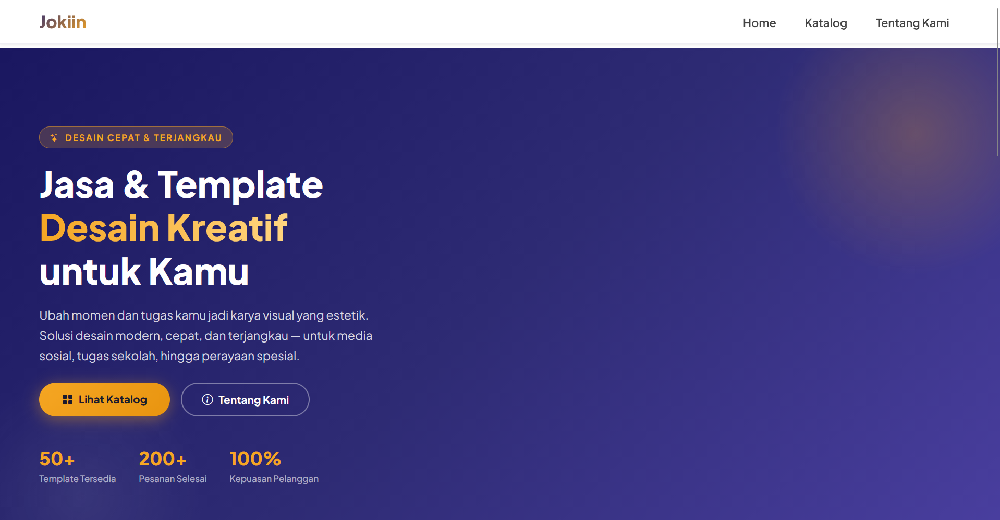
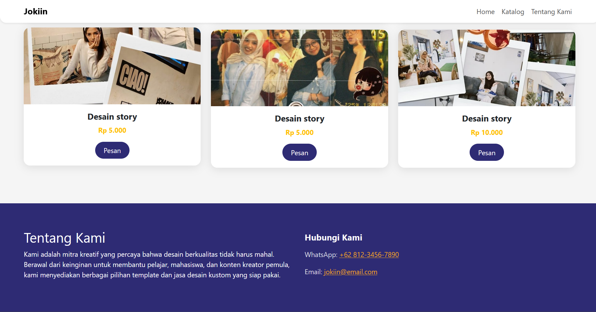
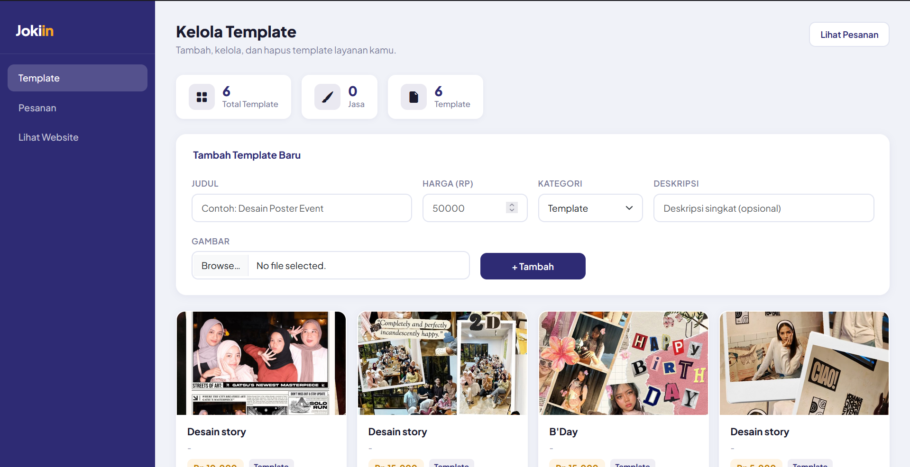
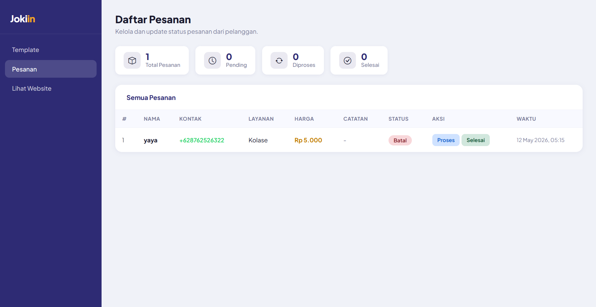
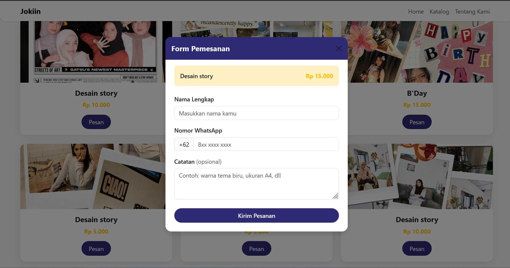

<p align="center">
  
</p>

# Jokiin - Platform Jasa & Template Desain (Laravel Based)

**Jokiin** adalah platform berbasis web yang dibangun menggunakan framework Laravel. Aplikasi ini dirancang untuk menyediakan layanan penjualan template desain dan jasa kustomisasi visual (seperti kolase foto, desain *story* media sosial, ucapan ulang tahun, dsb) secara cepat dan terjangkau untuk pelajar, mahasiswa, maupun kreator pemula.

Proyek ini terbagi menjadi dua sisi utama: **Landing Page** untuk pelanggan memilih layanan, dan **Dashboard Admin** terintegrasi untuk manajemen produk serta pelacakan pesanan secara *real-time*.

---

## 📸 Tampilan Antarmuka (Preview UI)

Disini adalah cuplikan tampilan dari aplikasi Jokiin:

<p align="center">
    
    
    
    
    
</p>

---

## 🗄️ Struktur Database

Proyek ini menggunakan database MySQL dengan skema tabel utama sebagai berikut:

### 1. Tabel `templates` (Menyimpan Katalog Layanan)
| Kolom | Tipe Data | Keterangan |
| --- | --- | --- |
| `id` | BigInt (Primary Key, Auto Increment) | ID unik setiap template |
| `judul` | VARCHAR | Nama atau judul template desain |
| `harga` | INT | Harga template dalam Rupiah |
| `kategori` | VARCHAR | Kategori produk (contoh: `template`, `jasa`) |1
| `deskripsi` | TEXT (Nullable) | Detail singkat mengenai produk |
| `gambar` | VARCHAR | Path/nama file gambar yang di-upload ke storage |
| `created_at` / `updated_at` | Timestamp | Waktu pembuatan & pembaruan data |

### 2. Tabel `orders` (Menyimpan Data Pesanan Masuk)
| Kolom | Tipe Data | Keterangan |
| --- | --- | --- |
| `id` | BigInt (Primary Key, Auto Increment) | ID unik setiap transaksi |
| `nama` | VARCHAR | Nama pelanggan/pemesan |
| `kontak` | VARCHAR | Nomor WhatsApp aktif pelanggan |
| `layanan` | VARCHAR | Nama layanan/template yang dipesan |
| `harga` | INT | Total harga yang harus dibayar |
| `catatan` | TEXT (Nullable) | Catatan tambahan dari pelanggan |
| `status` | VARCHAR | Status pesanan (`Pending`, `Diproses`, `Selesai`, `Batal`) |
| `created_at` / `updated_at` | Timestamp | Waktu pesanan masuk & perubahan status |

---

## 🚀 Fitur Utama

### 1. Sisi Pelanggan (Front-End)
* **Katalog Layanan Dinamis:** Menampilkan semua produk/template aktif langsung dari database lengkap dengan nama, gambar, dan harga.
* **Sistem Pemesanan Mudah:** Tombol pesan yang terhubung langsung untuk mencatat pesanan pelanggan.
* **Section 'Tentang Kami' & Kontak:** Informasi platform serta integrasi kontak WhatsApp/Email di bagian *footer*.

### 2. Sisi Administrator (Admin Panel)
* **Dashboard Statistik:** Menampilkan total template yang tersedia, jumlah jasa, serta rangkuman status pesanan (*Total Pesanan, Pending, Diproses, Selesai*).
* **Kelola Template (CRUD):** Form interaktif untuk menambah, melihat, dan mengelola item template baru (Judul, Harga, Kategori, Deskripsi, dan Upload Gambar).
* **Manajemen Pesanan:** Tabel data pesanan masuk untuk mengubah status transaksi pelanggan (*Batal, Proses, Selesai*) dengan sekali klik.

---

## 🛠️ Spesifikasi Teknologi

* **Framework:** Laravel (PHP)
* **Database:** MySQL / MariaDB (Eloquent ORM & Migrations)
* **Front-End:** Blade Templating Engine + Custom CSS / Tailwind CSS

---

## 📁 Cara Instalasi Proyek di Lokal

Ikuti langkah-langkah berikut untuk menjalankan proyek Jokiin di komputer kamu:

### 1. Clone Repositori & Masuk ke Direktori
```bash
git clone [https://github.com/username/jokiin.git](https://github.com/username/jokiin.git)
cd jokiin

```

### 2. Install Dependencies
```bash
composer install
```

### 3. Salin File Environment
```bash
cp .env.example .env
php artisan key:generate
```

### 4. Konfigurasi Database
Edit file `.env` dan sesuaikan pengaturan database:
```
DB_CONNECTION=mysql
DB_HOST=127.0.0.1
DB_PORT=3306
DB_DATABASE=db_jokiin
DB_USERNAME=root
DB_PASSWORD=
```

### 5. Jalankan Migrasi
```bash
php artisan migrate
```

### 6. Buat Symbolic Link Storage
```bash
php artisan storage:link
```

### 7. Jalankan Server
```bash
php artisan serve
```

Aplikasi bisa diakses di `http://localhost:8000`

---

## 🔐 Akun Login Admin

Gunakan kredensial berikut untuk masuk ke dashboard admin di `/admin/login`:

| Field    | Value         |
|----------|---------------|
| Username | `admin`       |
| Password | `rahasia123`  |

> Kredensial ini bisa diubah melalui file `.env` dengan menambahkan:
> ```
> ADMIN_USERNAME=nama_user_kamu
> ADMIN_PASSWORD=password_kamu
> ```

---
